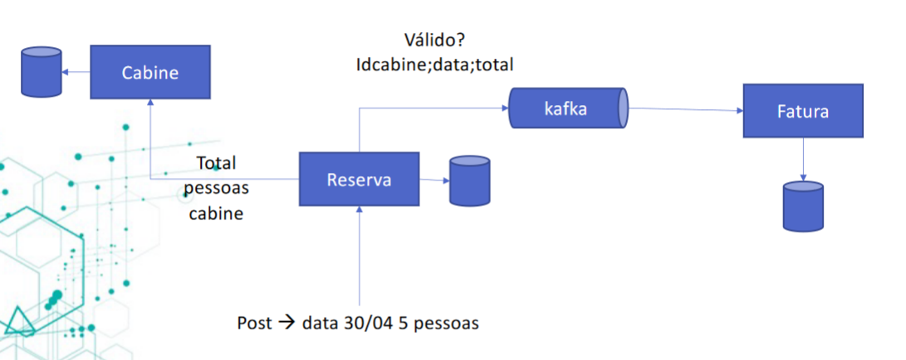
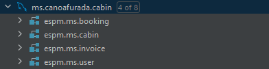

# :ship: Canoafurada 

A Spring Boot project built with a microservice architecture following OOP principles and with both REST and Messaging queues (Kafka) communication between the services.

### Context
"A cruise company called Canoa Furada decided to invest in a system for booking cabins on its ships and
in a technical meeting opted for the microservices architecture for this implementation."

## Links

### Services

[Gateway](https://github.com/PedroMiotti/espm.ms.canoafurada.gateway) - Service discovery gateway. **Port: 8761**  
[Invoice service](https://github.com/PedroMiotti/espm.ms.canoafurada.invoice) - Responsible for creating invoices for successfully booked cabins. **Port: 8085**  
[Cabin service](https://github.com/PedroMiotti/espm.ms.canoafurada.cabin) - Responsible for managing cabins. **Port: 8083** 
[Booking service](https://github.com/PedroMiotti/espm.ms.canoafurada.booking) - Responsible for managing bookings. **Port: 8082** 
[User service](https://github.com/PedroMiotti/espm.ms.canoafurada.user) - Responsible for managing users. **Port: 8084**  

Obs: Each service has its own documentation  
swagger-ui : <url>/api/swagger-ui/index.html  
actuator: <url>/api/actuator

## Basic architecture

## Databases

For each service there is a script for creating its database. Its located under /br/espm/canoafurada/resources/script_v1_mysql.sql

## Testing
If you want to test the endpoints, just download the `espminvest.poo.postman_colection.json` file inside the /.github folder, and import it into postman, all the routes are already pre-configured.

